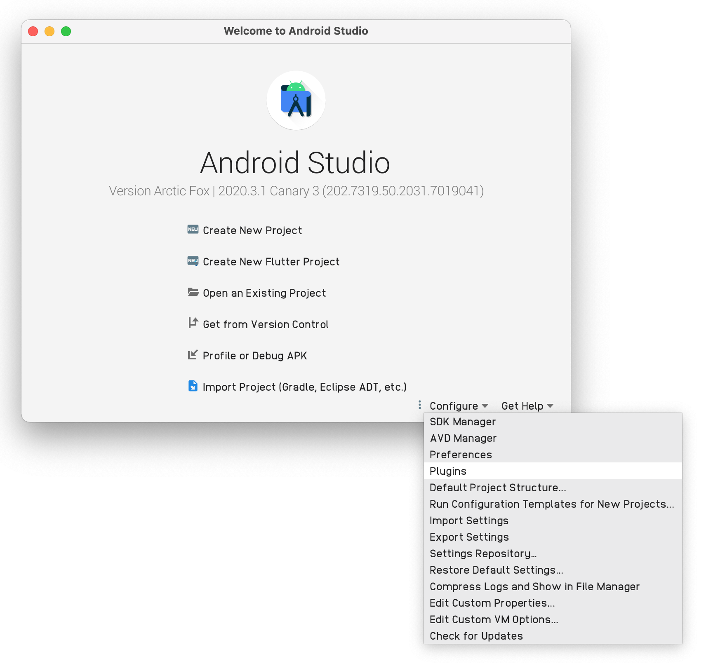
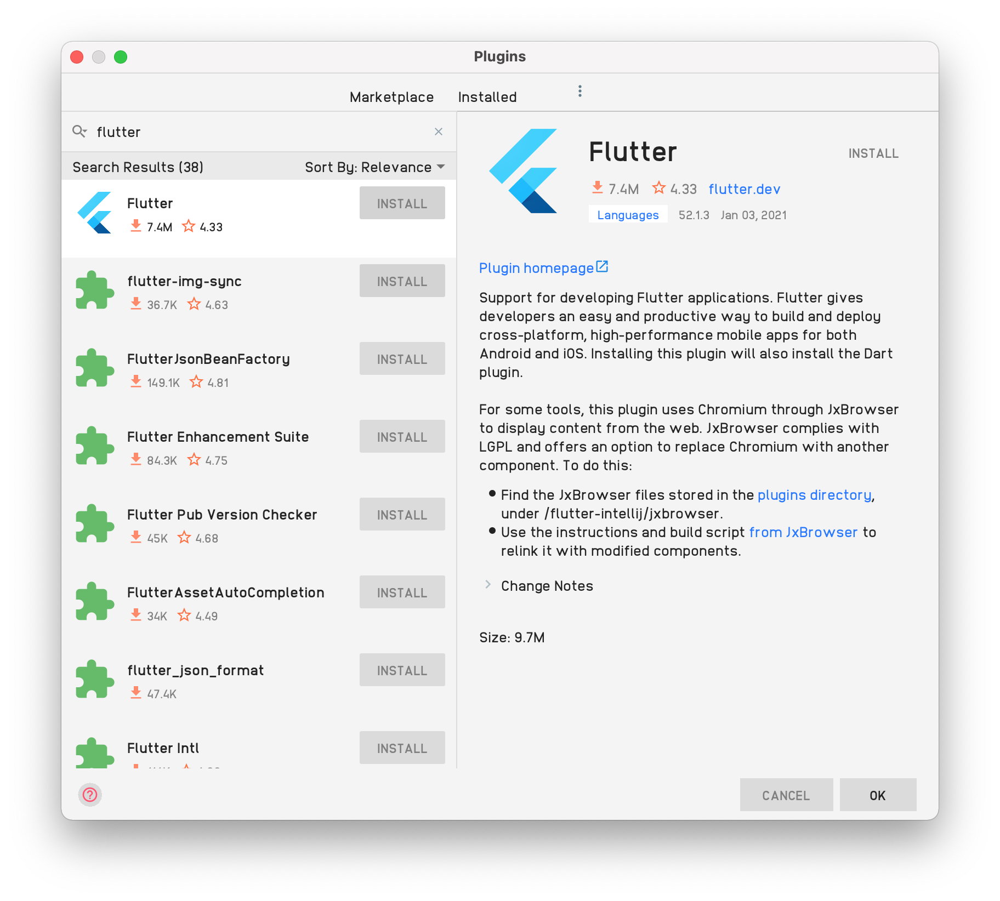
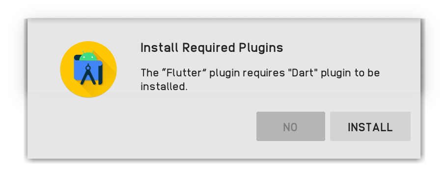
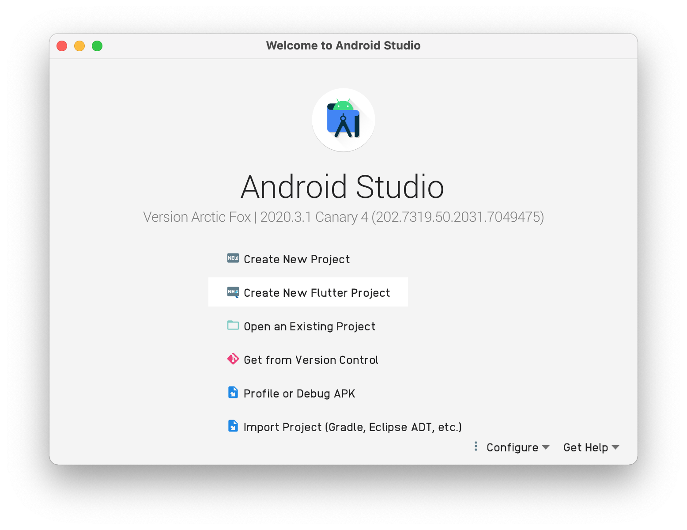
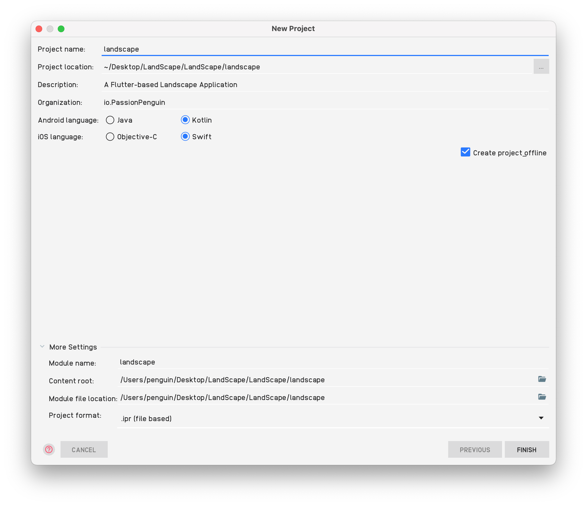

# [Part 1] Brief Introduction to Flutter
> Dart is a multi-platform language developed by Google, and based on it, Google has developed Flutter, providing a UI toolkit for building beautiful, natively compiled applications for mobile, web, and desktop from a single codebase.

![[Part 1] Brief Introduction to Flutter](../resources/Part-1.svg)

## Why Flutter
### Fast Development
Paint your app to life in milliseconds with Stateful Hot Reload. Use a rich set of fully-customizable widgets to build native interfaces in minutes.

### Expressive and Flexible UI
Quickly ship features with a focus on native end-user experiences. Layered architecture allows for full customization, which results in incredibly fast rendering and expressive and flexible designs.

### Native Performance
Flutter’s widgets incorporate all critical platform differences such as scrolling, navigation, icons and fonts, and your Flutter code is compiled to native ARM machine code using Dart's native compilers.

### To cut a long story short
Flutter is a UI SDK developed by Google to help developers build high-quality, native-ui across iOS, Android and other platforms.

In this tutorial, you will learn to create a simple Flutter application, and you are not required to have any Dart or any platform developing's experience, but to have basic object-oriented programming experience (such as variables, control statements, etc).

## How to set up the environment
At first you would need to install Flutter (as well as Dart) to your computer. It supports macOS， Windows, Linux and also the ChromeOS. Please follow the instruction in the [Install - Flutter](https://flutter.dev/docs/get-started/install) page.

### Set up an editor
You can build apps with Flutter using any text editor combined with our command-line tools. However, we recommend using one of our editor plugins for an even better experience. These plugins provide you with code completion, syntax highlighting, widget editing assists, run & debug support, and more.

In this part we will add the editor plugins for Android Studio.

### Add the plugins for Android Studio
#### Install Android Studio
Android Studio offers a complete, integrated IDE experience for Flutter.
* Android Studio, version 3.0 or later
  Alternatively, you can also use IntelliJ:
* IntelliJ IDEA Community, version 2017.1 or later
* IntelliJ IDEA Ultimate, version 2017.1 or later
#### Install the Flutter and Dart plugins
To install these:

* Start Android Studio.
* Open plugin panel (Configure > Plugins as of v3.6.3.0 or later).
  
* Select the Flutter plugin and click Install.
  
* Click Yes when prompted to install the Dart plugin. If you are required to install the Dart plugin, click Yes.
  
* Click Restart when prompted.

## How to use Flutter
### How to create a new Flutter Project
To create a new Flutter project, you would need to open your Android Studio.
* Open the IDE and select Create new Flutter project.
  
* Select Flutter Application as the project type. Then click Next.
  
* Verify the Flutter SDK path specifies the SDK’s location (select Install SDK… if the text field is blank).
* Enter project information. Then click Next.
  
* Click Finish.
* Wait for Android Studio to install the SDK and create the project.

As soon as Flutter finish creating the project, you will have these generated files: (with macOS, android and web enabled)

### How to add Flutter to existing app
#### Add-to-app
It’s sometimes not practical to rewrite your entire application in Flutter all at once. For those situations, Flutter can be integrated into your existing application piecemeal, as a library or module. That module can then be imported into your Android or iOS (currently supported platforms) app to render a part of your app’s UI in Flutter. Or, just to run shared Dart logic.

In a few steps, you can bring the productivity and the expressiveness of Flutter into your own app.

As of Flutter v1.12, add-to-app is supported for the basic scenario of integrating one full-screen Flutter instance at a time per app. It currently has the following limitations:
* Running multiple Flutter instances or running in partial screen views may have undefined behavior.
* Using Flutter in background mode is still a WIP.
* Packing multiple Flutter libraries into an application isn’t supported.
* Plugins used in add-to-app on Android should migrate to the new Android plugin APIs, based on FlutterPlugin.
* Plugins that don’t support FlutterPlugin might have unexpected behaviors if they make assumptions that are untenable in add-to-app (such as assuming that a Flutter Activity is always present).
As of v1.17, the Flutter module only supports AndroidX applications on Android.
  
For detail information about how to add flutter to your existing application, visit [Add Flutter to existing app](https://flutter.dev/docs/development/add-to-app#get-started).

In the next story, you will learn about:
* Flutter can adaptive different UI in different platforms such as Android, iOS.
* Flutter project's basic structure
* Finding and using packages to extend features
* Using Hot-Reload to fasten the developing
* Using stateful widgets
* Creating a infinite, async list