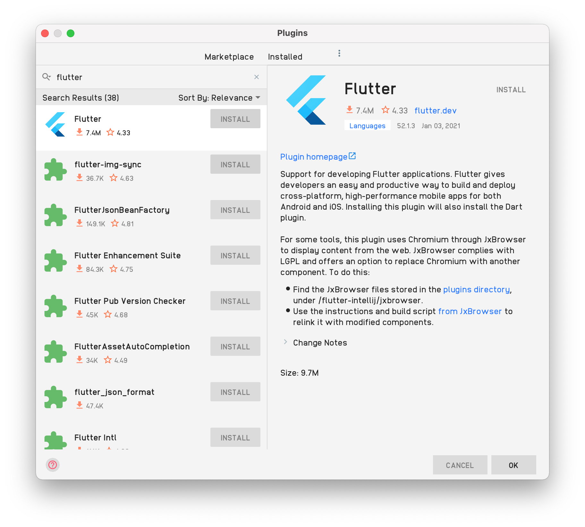
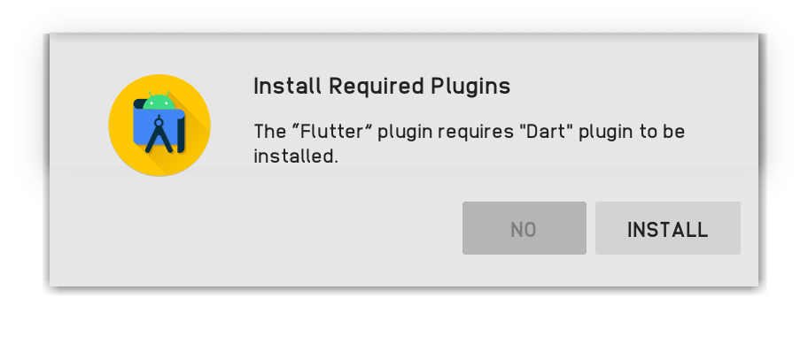
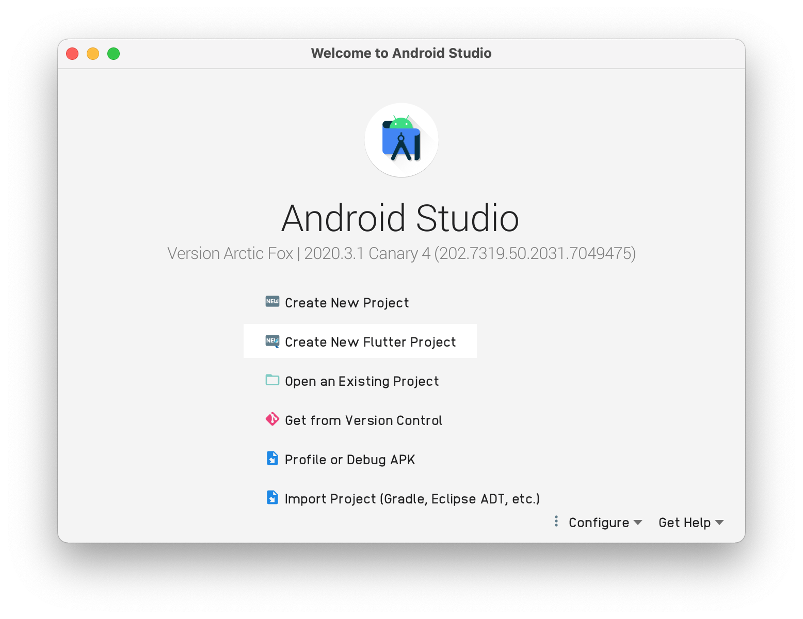
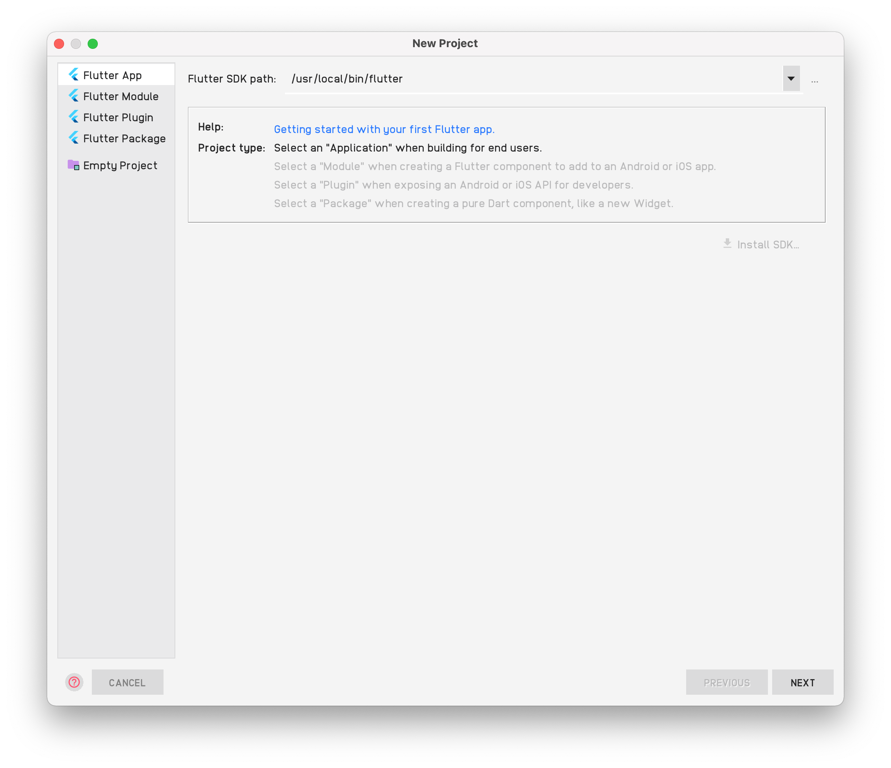
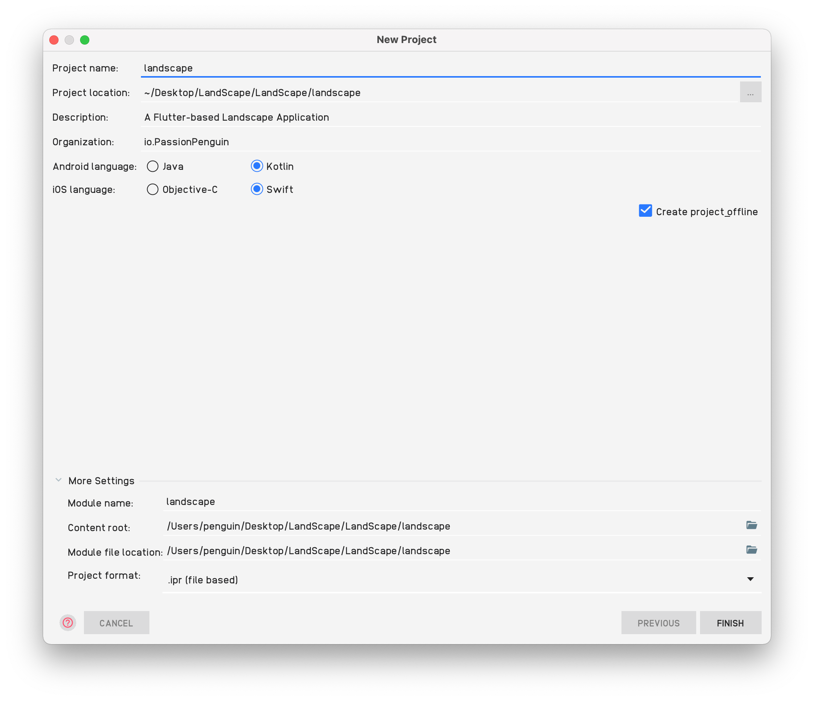
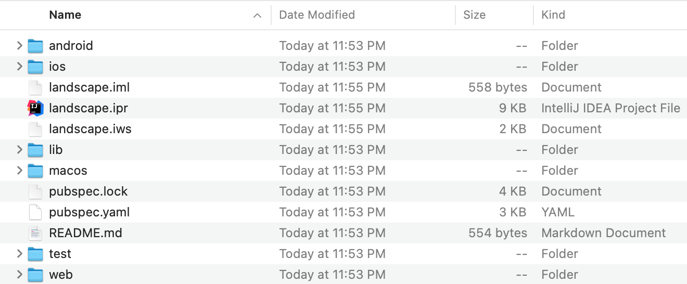

# [Part 1] Brief Introduction to Flutter
> Dart is a multi-platform language developed by Google and based on it, Google has developed Flutter. It is a UI toolkit developed for building beautiful, natively compiled applications for mobile, web, and desktop from a single codebase.

![[Part 1] Brief Introduction to Flutter](../resources/Part-1.svg)

## Why Flutter
### Fast Development
Paint your app to life in milliseconds with Stateful Hot Reload. Use a rich set of fully-customizable widgets to build native interfaces in minutes.

### Expressive and Flexible UI
Quickly ship features with a focus on native end-user experiences. The layered architecture allows for full customization, which results in incredibly fast rendering and expressive and flexible designs.

### Native Performance
Flutter’s widgets incorporate all critical platform differences such as scrolling, navigation, icons and fonts, and your Flutter code is compiled to native ARM machine code using Dart's native compilers.

### Comparison between Flutter and Native UI
Compared to Kotlin or Java in Android, you are not required to use dozens of code to make a new widget, and you're not required to implement all kinds of implementations and xml files declarations. 

With its simple widget annotation, you can simply mix up different kinds of widgets for example:
```dart
class LoginItem extends StatelessWidget {
  LoginItem({this.label});
  final String label;

  @override
  Widget build(BuildContext context) {
    return TextFormField(
      decoration: InputDecoration(
        labelText: label
      ),
    ); // You can customize the widgets here with all kinds of other widgets.
  }
}

class LoginCard extends StatelessWidget {
  @override
  Widget build(BuildContext context) {
    return Card(
      elevation: 4.0,
      child: Container(
        color: Colors.green,
        padding: EdgeInsets.symmetric(vertical: 8.0),
        child: Row(
          children: <Widget>[
            Expanded(child: LoginItem(label: 'Username')),
            Expanded(child: LoginItem(label: 'Password')) // Reuse the LoginItem widget
          ],
        ),
      ),
    );
  }
}
```
And you can even draw your own widget in a canvas in just a few lines like:
```dart
class TrianglePainter extends CustomPainter {
  final Color strokeColor;
  final PaintingStyle paintingStyle;
  final double strokeWidth;

  TrianglePainter({this.strokeColor = Colors.black, this.strokeWidth = 3, this.paintingStyle = PaintingStyle.stroke});

  @override
  void paint(Canvas canvas, Size size) {
    Paint paint = Paint()
      ..color = strokeColor
      ..strokeWidth = strokeWidth
      ..style = paintingStyle;

    canvas.drawPath(getTrianglePath(size.width, size.height), paint); // Use the method `Canvas.drawPath(Path path, Paint paint);`
  }

  Path getTrianglePath(double x, double y) {
    return Path()
      ..moveTo(0, y)
      ..lineTo(x / 2, 0)
      ..lineTo(x, y)
      ..lineTo(0, y);
  }

  @override
  bool shouldRepaint(TrianglePainter oldDelegate) {
    return oldDelegate.strokeColor != strokeColor ||
        oldDelegate.paintingStyle != paintingStyle ||
        oldDelegate.strokeWidth != strokeWidth;
  }
}
```

Compared to SwiftUI, Flutter is not so sticky and it is a lot more customizable which means you can easily separate your code between the presentation layer and others. You are not required to mix your UI widgets with other non-UI code, and you can recreate your own widget with the original dart files in the folder `$FLUTTER_BASE_URL/packages/flutter/lib/src`.

But what's the most attractive feature of Flutter? Thanks to Flutter/Dart's multi-platform support, you can even build the application across Windows, Linux, macOS, ChromeOS, iOS / iPadOS, Android, even Fuchsia at the same time just with the same code! Yep, it's time for paying attention to the backend. Well, you can use Dart to build your serverside application, isn't that right?

The only thing you need to enable all these features is to run `flutter config` in your terminal. Let's have a quick look at the usages:
```bash
$ flutter config
Usage: flutter config [arguments]
    --[no-]enable-web                           Enable or disable Flutter for
                                                web. This setting will take
                                                effect on the master, dev, and
                                                beta channels.
    --[no-]enable-linux-desktop                 Enable or disable Flutter for
                                                desktop on Linux. This setting
                                                will take effect on the master
                                                and dev channels.
    --[no-]enable-macos-desktop                 Enable or disable Flutter for
                                                desktop on macOS. This setting
                                                will take effect on the master
                                                and dev channels.
    --[no-]enable-windows-desktop               Enable or disable Flutter for
                                                desktop on Windows. This setting
                                                will take effect on the master
                                                and dev channels.
    --[no-]single-widget-reload-optimization    Enable or disable Hot reload
                                                optimization for changes to
                                                class body of a single widget.
                                                This setting will take effect on
                                                the master, dev, beta, and
                                                stable channels.
    --[no-]enable-android                       Enable or disable Flutter for
                                                Android. This setting will take
                                                effect on the master, dev, beta,
                                                and stable channels.
    --[no-]enable-ios                           Enable or disable Flutter for
                                                iOS. This setting will take
                                                effect on the master, dev, beta,
                                                and stable channels.
    --[no-]enable-fuchsia                       Enable or disable Flutter for
                                                Fuchsia. This setting will take
                                                effect on the master channel.
```

So we will just need to run:
```bash
$ flutter config --enable-linux-desktop # Enable Flutter for Linux Desktop
$ flutter config --enable-macos-desktop # Enable Flutter for macOS Desktop
$ flutter config --enable-windows-desktop # Enable Flutter for Windows Desktop
$ flutter config --enable-fuchsia # Enable Flutter for Fuchsia
```

---

In this tutorial, you will learn to create a simple Flutter application. You are not required to have any Dart or any platform development experience, but to have some basic object-oriented programming experience (such as variables, control statements). Let's start coding.

## How to set up the environment
You would need to install Flutter and Dart to your computer before anything else you should do. It supports macOS， Windows, Linux, and also ChromeOS. Please follow the instruction in the [Install - Flutter](https://flutter.dev/docs/get-started/install) page.

If you’re in China, visit [Install - Flutter](https://flutter.cn/docs/get-started/install) and replace all the related environment arguments.

### Set up an editor
You can build apps with Flutter using any text editor combined with our command-line tools. However, we recommend using one of our editor plugins for an even better experience. These plugins provide you with code completion, syntax highlighting, widget editing assists, run & debug support, and more.

In this part, we will add the editor plugins for Android Studio.

### Add the plugins for Android Studio
#### Install Android Studio
Android Studio offers a complete, integrated IDE experience for Flutter.
* Android Studio, version 3.0 or later
  Alternatively, you can also use IntelliJ:
* IntelliJ IDEA Community, version 2017.1 or later
* IntelliJ IDEA Ultimate, version 2017.1 or later
#### Install the Flutter and Dart plugins
To install these:

* Start Android Studio.
* Open plugin panel (Configure > Plugins as of v3.6.3.0 or later).
  
* Select the Flutter plugin and click Install.
  
* Click Yes when prompted to install the Dart plugin. If you are required to install the Dart plugin, click Yes.
  
* Click Restart when prompted.

## How to use Flutter
### How to create a new Flutter Project
To create a new Flutter project, you would need to open your Android Studio.
* Open the IDE and select Create new Flutter project.
  
* Select Flutter Application as the project type. Then click Next.
  
* Verify the Flutter SDK path specifies the SDK’s location (select Install SDK… if the text field is blank).
* Enter project information. Then click Next.
  
* Click Finish.
* Wait for Android Studio to install the SDK and create the project.

As soon as Flutter finish creating the project, you will have these generated files: (with macOS, Android, and web-enabled)


You can also open a terminal and run the flutter create <project name> command to create a starter project, Here is an example:

`$ flutter create myapp`

### How to add Flutter to existing app
#### Add-to-app
It’s sometimes not practical to rewrite your entire application in Flutter all at once. For those situations, You can integrate Flutter into your existing application piecemeal as a library or module. That module can then be imported into your Android or iOS (currently supported platforms) app to render a part of your app’s UI in Flutter. Or just to run shared Dart logic.

In a few steps, you can bring the productivity and the expressiveness of Flutter into your app.

As of Flutter v1.12, add-to-app is supported for the basic scenario of integrating one full-screen Flutter instance at a time per app. It currently has the following limitations:
* Running multiple Flutter instances or running in partial screen views may have undefined behavior.
* Using Flutter in background mode is still a WIP.
* Packing multiple Flutter libraries into an application isn’t supported.
* Plugins used in add-to-app on Android should migrate to the new Android plugin APIs, based on FlutterPlugin.
* Plugins that are not supported by FlutterPlugin might have unexpected behaviors if they make assumptions that are untenable in add-to-app (such as assuming that a Flutter Activity is always present).
  As of v1.17, the Flutter module only supports AndroidX applications on Android.

For detailed information about how to add Flutter to your existing application, visit [Add Flutter to existing app](https://flutter.dev/docs/development/add-to-app#get-started).

## Running your Flutter app
Use the flutter run command to run your Flutter app on a connected device or simulator.

### Running your app from the command-line

Open a terminal and change directories to the root of your app (the same directory that contains the pubspec.yaml file for your project).
Run the following command. Once the flutter tool is running, if you change the app’s source code, you can hit r to hot-reload your application (updating the source on the fly without actually restarting the entire app).
```bash
$ cd myapp
$ flutter run
```
If more than one device is connected, use the flutter devices command to get their IDs, and then flutter run -d deviceID to run your app.

### Running your app from Android Studio
Alternatively, if you are using the Android Studio with the Flutter plugins, you can start your Flutter app from there:

In Android Studio, click the Run icon in the toolbar, or invoke the menu item Run > Run.


If everything works, you should see your starter app on your device or simulator.

### Hot Reload

Flutter offers a fast development cycle with hot reload, the ability to reload the code of a live running app without restarting or losing app state. Simply make a change to your source code, tell your IDE or command-line tool that you want to hot reload, and see the change in your simulator, emulator, or device.


To edit your code and hot reload changes:

Run your app with ‘Run’ or ‘Debug’.
Make desired changes in your source code (without stopping the app).
Simply save the file or click the Hot Reload Button in the toolbar (the button with the lightning bolt and the green run triangle).